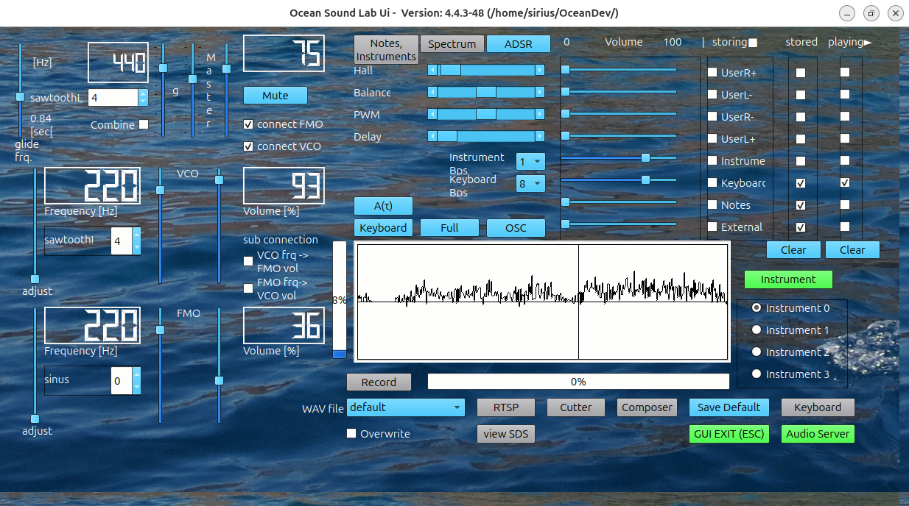

# Ocean Sound lab Ocean-SL

Ocean Sound Lab is a C++Project that provides a set of Sound Managing Applications, such as 
Synthesizer, Audioserver, Composer with Graphical UserInterface and tools for Linux based Operating Systems, that allows to generate, play and record sound. It includes interfaces for musicxml-files and supports the sound drivers: -> native ALSA and -> Pulseaudio and consists of a direct interface to musescore3 and sound converting tools like ffmpeg and id3tool. The binary distribution of Ocean-SL is limited to the architectures x86_64 and aarch64. This distribution includes the 3rd party libraries for Qt6, RtAudio and tinyxml2. It is tested and compiled on ubuntu 2025-10 with x86_64 on NUC and amd aarch64 on rasperry.

A screen shot of the graphical user interface shall illustrate some of its feature:

 

Author Ulrich Glasmeyer, Germany, during the time 2023 - 2025+

This distribution of Ocean-SL contains the following
- bin	: Audioserver, Synthesizer, Keyboard, Qt6-Userinterface OceanGUI, SDSview, Rtsp
- lib	: Qt6-runtime, tinyxml2 and RtAudio runtime, libOcean.so
- etc	: configuration file and sample program, notes and sound files
- doc	: user documentation
- var	: sample wav files

Ocean-SoundLab

The Ocean in the name of the software stands for waves. These wave are stimulated and summed up 
by the wind on the Ocean. Take this picture and apply it to sound waves. These wave are put together by the Sound Lab. Combining harmonic OSC, VCO and FMO base frequencies with harmonic overtones provides an infinite (10^60) sound universe on one hand. 
Select a specific point out of this univers and you get an instrument. With this instrument you
can play music, e.g. with notes from a musicxml-file or with your keyboard on the desk. You can 
add rythm to the sound and combine up to four synthesizer processes. All orchestrated by one 
graphical userinterface. Record these sounds and convert it into personalzed mp3-music files.
Thats it.

I am not a professional musician but a physician. Its up to you for the next step.

The software was designed for 
- scalability and c++performance, 
- easy to use (once you are familiar with its features), 
- reliable process control with state machine
- reproducable results
- by programable synthesizer controls

Source code is available at https://github.com/uglasmeyer/ocean
To compile the project take a download of the latest source code.

There are some prerequisites:
- gcc --version with support for cxx standard 23, eg: (gcc (Ubuntu 15.2.0-4ubuntu4) 15.2.0)
- Qt6 development environment core, widgets, gui ( sudo apt install qtcreator) and qmake (qt6-base-dev)
- tinyxml2 development environment ( sudo apt install libtinyxml2-dev )

If these prerequisites are fulfilled on the Linux machine you can use the cmake system to generate a makefile system as follows:
- change to the Cmake directory of the source code distribution (because of pwd),
- check the file CMakeLists.txt. 

By default the generated makefile system will create the binary files in HOME/OceanDev. The source code is aimed to update an existing runtime, that might contain customizations. For this reason make sure you have installed the binary distribution first and after this, you can overwrite the lib and bin files there, with the compiled files from the source code.

Check also the correctness of include dirctory Qt6. Especially in case of a porting.
Enter the command: 

- cmake CMakeLists.txt

if this was successful, enter the command: 

- make

Please don't heasitate to contact me by e-mail
Ulrich.Glasmeyer@web.de for support.

Open Issues:
	known unknowns
