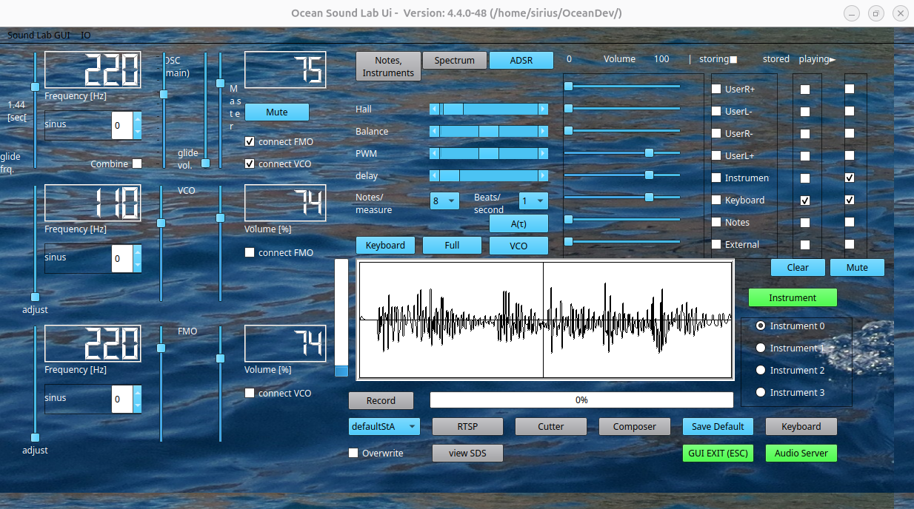

# ocean_sound_lab v4.4.0-48

Summary
- Prebuilt binary and runtime distribution for release 4.4.0-48 (tarball).

what's included
- ocean_sound_lab_4.4.0-48.tar.gz - prebuilt binaries for linux x86_64, aarch64, Ubuntu libc.so.6
and supporting files.

- Ocean Sound Lab provides a programmable set of Sound Managing Applications, such as Synthesizer, 
Audioserver, Composer with Graphical UserInterface for Linux based Operating Systems, 
that allows to generate, play and record sound. 
It includes interfaces for musicxml-files, supports the sound drivers: native ALSA and Pulseaudio 
and consists of a direct integration of musescore3 and the music file converting tools 
ffmpeg and id3tool. 
This distribution includes the 3rd party runtime libraries for Qt6, RtAudio and tiny2xml 
and is tested and compiled on ubuntu 2025-10 for x86_64 and aarch64 on rasperry PI and NUC.

Installation
1. Download the tarball from the Release assets.
2. Extract:
   tar -xzf ocean_sound_lab_4.4.0-48.tar.gz
3. Follow the install.txt inside the extracted folder for runtime/setup instructions.

Verification
		- verify cksum (as provided by packager):
		1867197490 161526805 ocean_sound_lab_4.4.0-48.tar.gz
- verify SHA-256 locally: 
a61799aeb162a54d551429920f638d423ec93c7d3945f6667fdefcd38c8af8dc  ocean_sound_lab_4.4.0-48.tar.gz
- Verify: shasum -a 256 -c ocean_sound_lab_4.4.0-48.tar.gz.sha256

License & source
- This binary distribution is provided under the terms in the repository LICENSE file.
- Full source corresponding to this build is available at:  
https://github.com/uglasmeyer/ocean/releases/tag/v4.4.0-48

Notes
- N/A. If this release contains breaking changes, document migration steps here.
- Consumer should refer to further information in the Ocean-SL_Usermanual.pdf, but should consider 
this as beeing under construction with respect to a
- comprehensive desription of GUI features
- and workflows
- documentation of the keyboard usage and features
- libOcean.so SDS structure

Changelog
- combined distribution of x86 and arch binaries
- GUI Cut desk, allowing to cut recorded wav files
- updated installation instructions
- Usability features

